# Stockelio

Stockelio es un proyecto diseñado como base para aplicar mis conocimientos en **testing**, **despliegue continuo**, **buenas prácticas**, **desarrollo sostenible**, etc. Está desarrollado con **Laravel 11** e **Inertia.js** utilizando **React** con **TypeScript**.

## ¿Qué es Stockelio?

Stockelio permite a programadores con conocimientos técnicos crear y gestionar su propia tienda de **e-commerce** en línea. Utiliza:
- La API de **[Printful](https://www.printful.com/)** para la creación y gestión de productos.
- La API de **[Stripe](https://stripe.com/)** para la integración de pagos.

El objetivo es proporcionar un sistema funcional para el comercio electrónico.

Actualmente se encuentra en desarrollo. A continuación, se encuentran capturas del progreso actual.

---

## Tecnologías principales

  
  
  

---

## Funcionalidades principales

### Dashboard
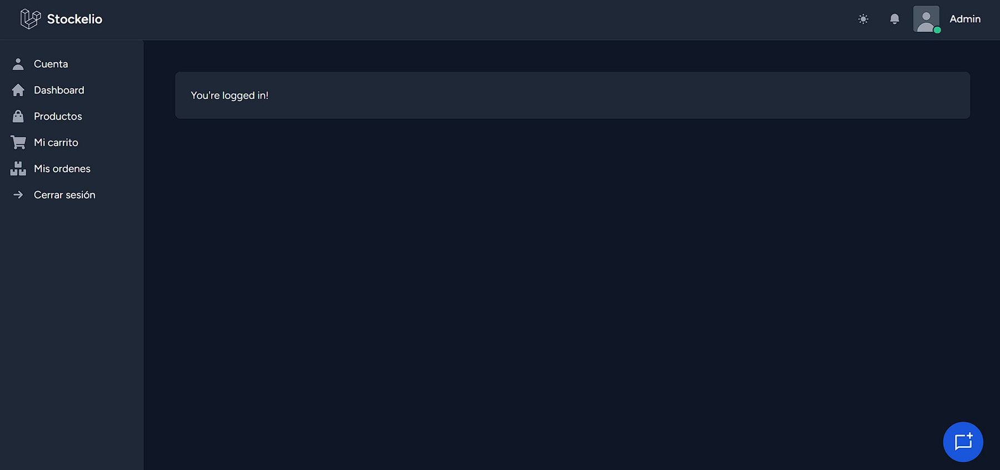

### Catálogo de productos
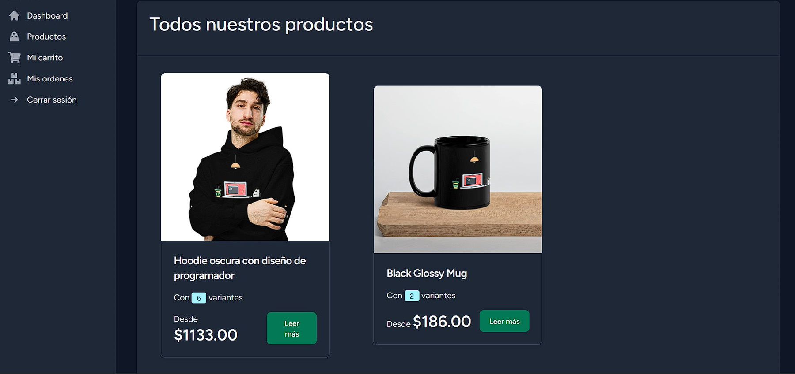

### Detalles del producto
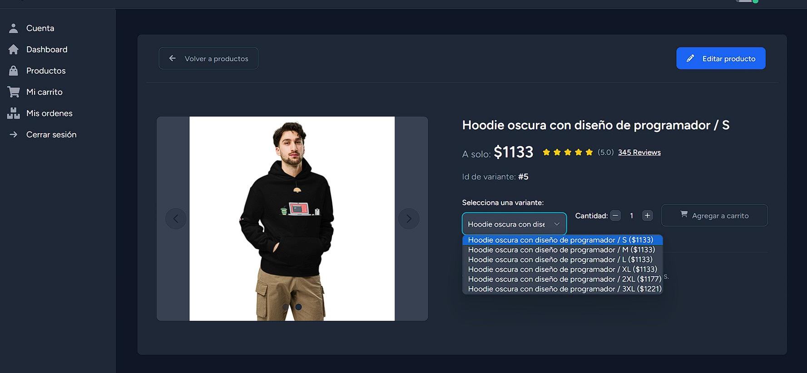

### Añadir ubicación
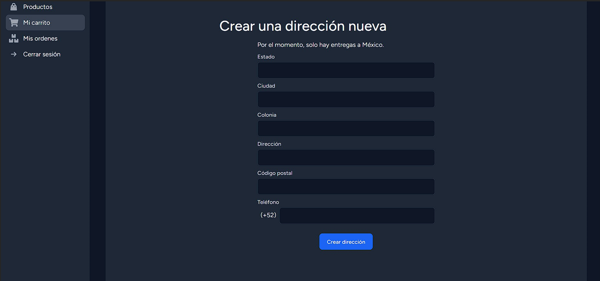

### Editar ubicación
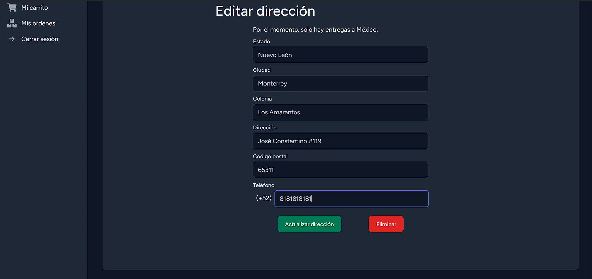

### Administrar ubicaciones
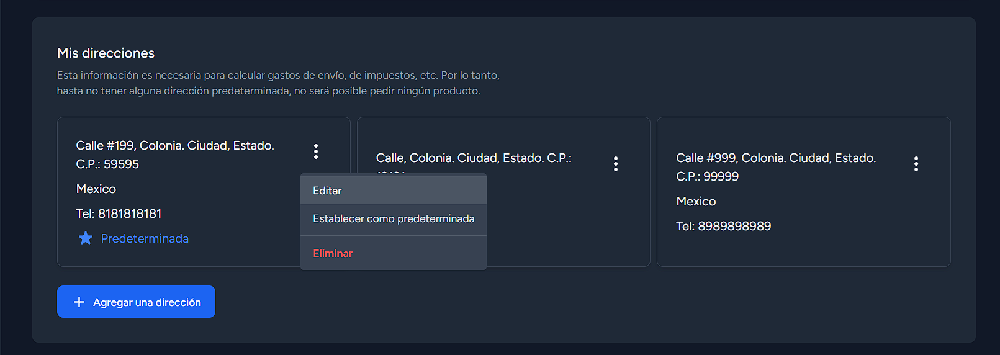

### Mi carrito
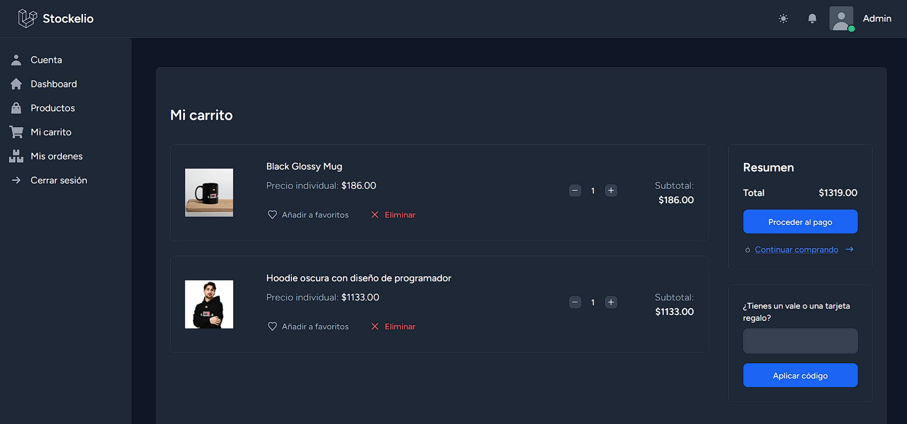

### Pasarela de pago con Stripe
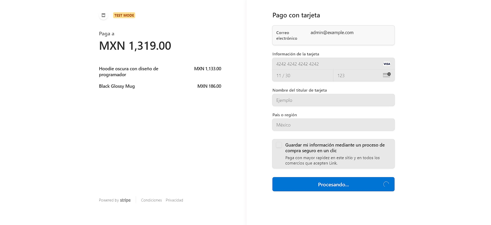

### Ordenes pendientes
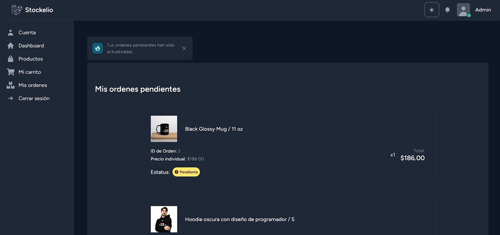

### Detalles de la orden
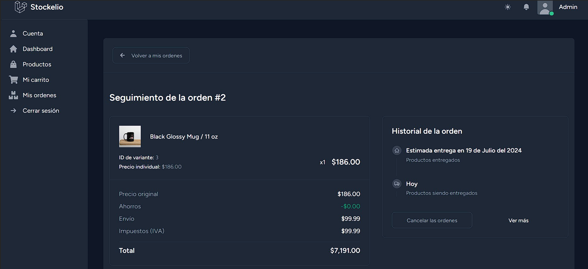

### Chats en tiempo real
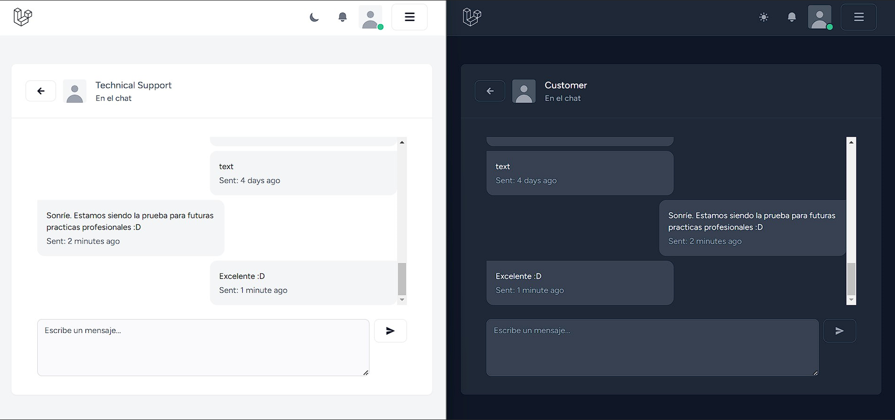

### Notificaciones en tiempo real
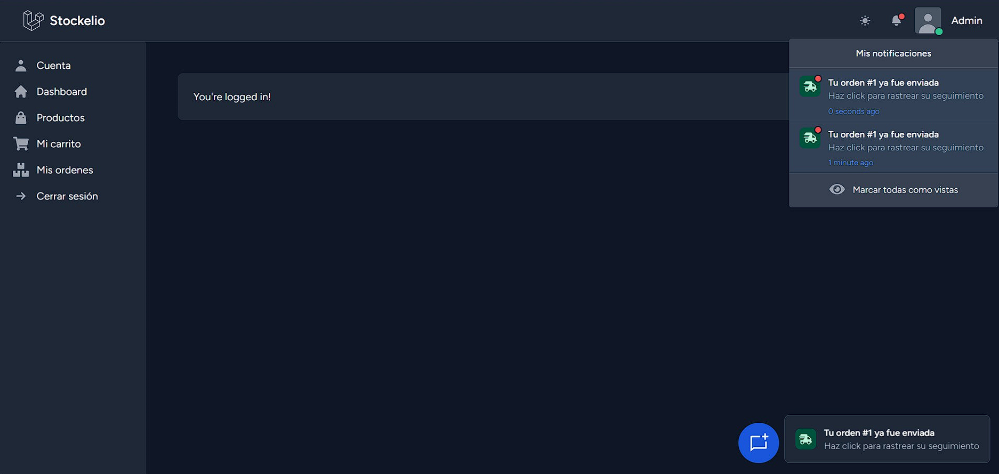

---

## Estado del proyecto

Stockelio está actualmente **en desarrollo**. Próximos pasos:
- Mejorar la documentación para incluir temas pendientes, como:
  - Configuración y activación de **Printful** y **Stripe**.
  - Guía detallada para el despliegue.

¡Cualquier comentario, sugerencia o contribución será muy bienvenido!
